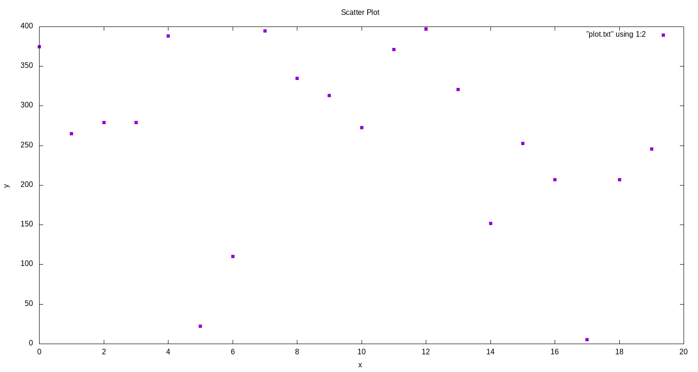
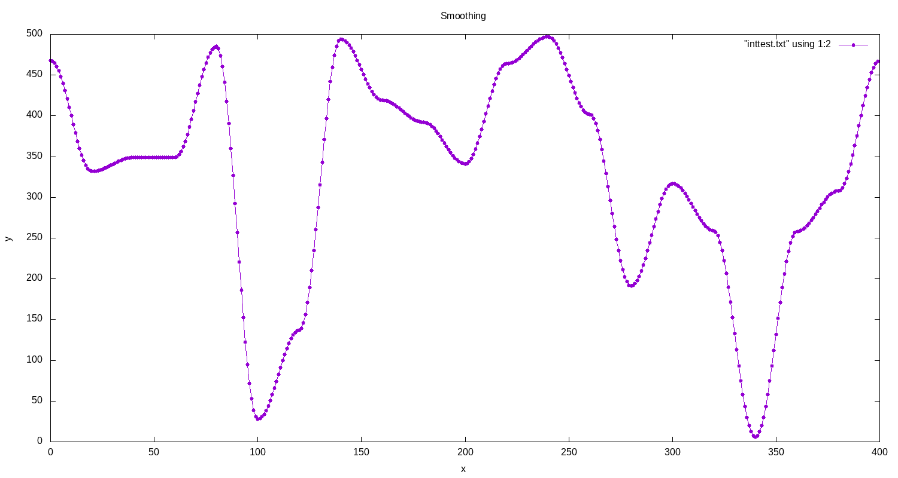
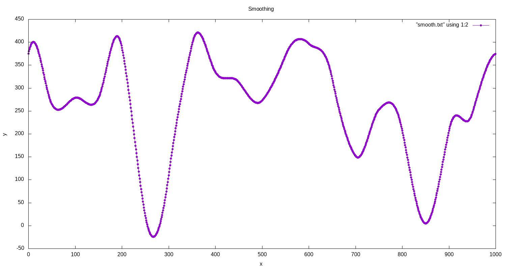

# INTERPOLATIONS

---

### Example Scatter-Plot:

__TASK:__

Being able to interpolate points in any scatter plot.

---

---

### NAIVE SINE IMPLEMENTATION: 

__Found in sinemapping.c__

---

---

### Output COSINE:

---

---

### Output CUBIC:

---

---

